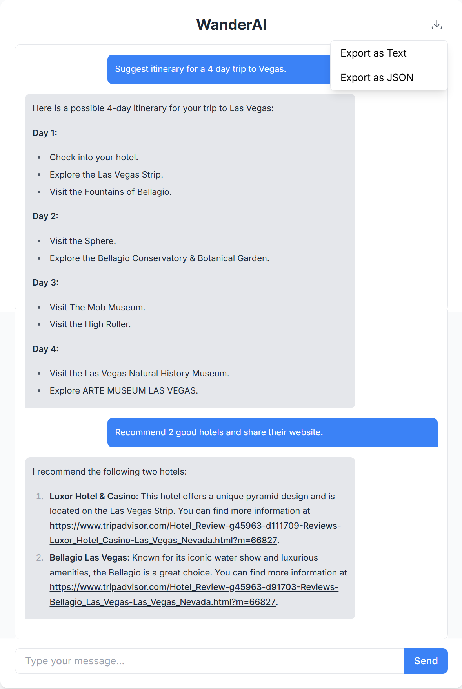

# WanderAI

A chat-based AI travel planning assistant that helps users create personalized travel itineraries using real-time data from TripAdvisor.

## Project Description

WanderAI is an intelligent travel planning web application that combines the power of Large Language Models (LLMs) with real-time TripAdvisor data to assist users in planning their trips. Through a conversational interface, users can:

- Search for attractions, hotels, and restaurants
- Get detailed information about specific locations
- Create travel itineraries
- Export their travel planning conversations

## Tech Stack

### Backend
- Spring Boot & Spring WebSocket
- Langchain4j & Langgraph4j for AI agent orchestration
- Google Gemini LLM
- TripAdvisor API integration
- STOMP protocol for WebSocket communication

For detailed backend setup and configuration, see the [Backend README](backend/README.md).

### Frontend
- Next.js
- React
- TypeScript
- Tailwind CSS
- WebSocket client (STOMP)

For detailed frontend setup and configuration, see the [Frontend README](frontend/README.md).

## Capabilities

### Real-time Data Access
- Location search across multiple categories (attractions, hotels, restaurants)
- Detailed information retrieval (ratings, reviews, contact info, etc.)
- Current operating hours and availability

### Interactive Planning
- Natural language conversation for travel planning
- Dynamic itinerary creation
- Contextual recommendations

### User Interface
- Clean, modern chat interface
- Real-time message updates
- Chat export functionality (TEXT/JSON formats)

## Backend Agent Architecture

WanderAI implements an adaptive RAG (Retrieval-Augmented Generation) system with three specialized agents:

### 1. Supervisor Agent
- Main decision-making and routing control
- Evaluates user queries and delegates to specialized agents
- Manages conversation flow and response generation

### 2. Search Agent
- Specialized in location discovery
- Handles search queries across different categories
- Integrates with TripAdvisor search API

### 3. Details Agent
- Retrieves comprehensive location information
- Processes and formats detailed data for user consumption
- Integrates with TripAdvisor details API

## Limitations

### Current Limitations
- No persistent conversation storage
- No user authentication system
- API rate limits from TripAdvisor and LLM (Gemini)
- Potential LLM-related limitations:
  - Occasional inaccurate responses
  - Response generation errors
  - Model-specific constraints

### Future Improvements
- Implement user authentication
- Add conversation persistence
- Expand API integration
- Enhance error handling and recovery
- Implement rate limiting safeguards